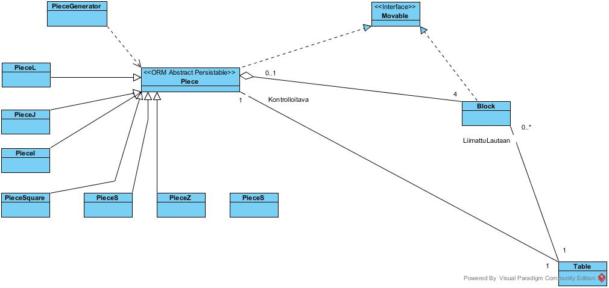

#Aihem‰‰rittely

**Aihe:** Reaaliaikainen Tetris, jota on tarkoitus pysty‰ pelaamaan n‰pp‰imistolt‰ ja sen saa alkamaan Swing-kayttoliittym‰st‰. Modifikaatioita, joita konfiguroidaan k‰yttˆliittym‰st‰, toteutetaan taitojen mukaan. N‰it‰ ovat esimerkiksi palikoiden v‰rien valinta, kent‰n koko yms..

**K‰ytt‰j‰t:** Taman kurssin opiskelijat ja opettajat sek‰ muut satunnaisk‰ytt‰j‰t.

**Kaikkien k‰ytt‰jien toiminnot:**

- Pelin konfigurointi (esim. kent‰n koko, pelin vaikeusaste ja palikoiden v‰rit)
- Pelin k‰ynnistys
- Palasen k‰‰ntely
- Palasen liikuttaminen oikealle
- Palasen liikuttaminen vasemmalle
- Palasen tippumisnopeuden lis‰‰minen
- Pelin keskeytt‰minen

##Rakennekuvaus**

Peli koostuu pelilogiikasta (Logic) ja sit‰ k‰ytt‰v‰st‰ peliluupista (GameLoop), joka kutsuu pelilogiikan metodia UpDate() booleanparametreill‰, jotka pelilooppi pyyt‰‰ aina n‰pp‰imistˆnkuuntelijalta (KeyPressListener). Myˆs piirt‰j‰ (abstracti Renderer, t‰ss‰ versiossa MyFirstRenderer) k‰ytt‰‰ logiikkaa. Renderluuppi puolestaan pyyt‰‰ piirt‰j‰‰ piirt‰m‰‰n pelitilanteesta kuvan. Luupit toimivat omissa threadeiss‰‰n.

Logiikka taas koostuu rakenneosasista Table ja Piece (abstracti luokka, jolla useita aliluokkia). Table sis‰lt‰‰ muunmuassa taulukon Blockeja, jotka ovat perusrakenneosasia peliss‰. Piece koostuu myˆs nelj‰st‰ blockista. Block ja Piece toteuttavat rajapinnan Movable, joilla tulee olla metodit moveDown(), moveUp(), moveLeft(), ja moveRight(). Piece toteuttaa n‰m‰ metodit yksinkertaisesti kutsumalla jokaiselle sis‰lt‰m‰lleen Blockille vastaavat kutsut. Piecen lis‰metodit rotateLeft() ja rotateRight() kutsuvat myˆs Blockien alkeellisempia liikkumisk‰skyj‰. 

Logiikalla on muutamia apuluokkia nimelt‰‰n LevelManager, LimitGuard, RowManager ja PieceGenerator. Levelmanager hoitaa pisteenlaskun ja leveleil‰ etenemisen, sek‰ laskee tuhottujen rivien m‰‰r‰n. RowManager sis‰lt‰‰ rivioperaatioita hoitavat metodit, ja LimitGuard toimii apuna pelikent‰n ja siirrett‰v‰n palikan kontakteista. Piecegenerator luo tarvittaessa uuden piecen. Logiikka osaa tarvittaessa liitt‰‰ Piecen "current" sis‰lt‰m‰t blockit Table -luokan taulukkoon, ja kutsuu samalla piecegeneratorilta uutta palasta.

Lis‰ksi logiikka k‰ytt‰‰ abstractin Command -luokan aliluokkia, joita k‰ytet‰‰n aina, kun update() metodin kutsussa on niit‰ vastaavat parametrit.

Pelin k‰ynnist‰minen ja alkuvalikossa selaaminen, sek‰ optionsien valitseminen taphtuu suhtkoht monimutkaisessa k‰yttˆliittym‰kokonaisuudessa, jota en sen tarkemmin selvenn‰, sill‰ pelin voi k‰ynnist‰‰ normaaliasetuksilla ilman niihin sekaantumista. Mainittakoon vain, ett‰ StateCoordinator on ActionListener, joka kuuntelee StartingScreenin sek‰ GameScreenin nappulakomentojakomentoija ja osaa n‰iden perusteella koordinoida esimerkiksi sit‰, mik‰ ikkuna milloinkin on aktiivinen, onko peli k‰ynniss‰ yms.. GameCenterUnit on pelin keskusyksikkˆ, joka alustaa ja rakentaa pelin, ja jolta tarvittaessa voi kysy‰ tietoja eri olioiden tiloista, sill‰ se toimii myˆs linkkin‰ tarvittaville yhteyksille.  

